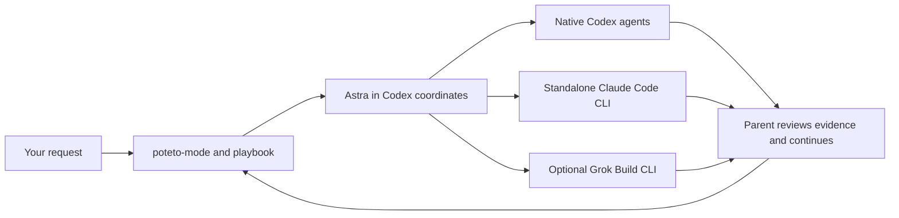

# pstack for Codex

The pstack workflow library, adapted for Codex orchestration with standalone Claude Code CLI workers and an optional Grok Build backend.

This is an independent port of [Lauren Tan's pstack](https://github.com/cursor/plugins/tree/main/pstack), pinned to **0.15.2** at `5bf2b1544db739998121a306340631963c2ff3de`. It preserves the original skills, principles, playbooks, references and agent-role instructions. The Codex host adaptations are explicit and inspectable. It is not an official Cursor, OpenAI or xAI release.

## How it works

Activate `$pstack-codex:poteto-mode` and describe the outcome you want. Poteto mode chooses the playbook and supporting skills. It can move through `how`, `architect`, `arena`, implementation, review and verification without you listing that sequence. Follow-ups continue the current work; `new task` rematches; `exit poteto-mode` stops applying the mode.



The plugin is reusable across projects. Build commands, verification harnesses, deployment effects and business rules come from the current project. Activation and mode state are scoped to the conversation and project, not switched on globally for every chat.

## Status

This is an early, tested port, **not a claim of complete Cursor runtime parity**. Read [verification](docs/verification.md) for the exact evidence and remaining gaps.

- All **47 registered pstack skills**, **23 playbooks**, **23 principles**, two agent roles, three companion skills, and the three dormant Benny skills are retained.
- Claude analysis and writer profiles have been exercised against the real CLI; native/Claude handoffs and mode lifecycle have dedicated checks.
- Grok's adapter is optional. Its protected live probe was blocked by a local sandbox startup error. Grok reader/writer profiles are not enabled.
- Cursor cloud placement, Grok Bot webhooks, Benny event automations, some transcript integrations and model-specific plan validation still have explicit limitations. Their source and routes remain present. Missing capabilities do not become silent weaker substitutes.

## Install

Requirements: a supported local Codex installation, Python 3.10+ on POSIX, and Git. Claude roles also require an independently installed and authenticated [Claude Code CLI](https://code.claude.com/docs/en/overview). Grok roles require independently installed [Grok Build](https://docs.x.ai/build/overview). Bun and GitHub CLI are needed for the upstream helpers that use them; they are not required for reading a skill.

```sh
git clone https://github.com/J0UH/pstack-codex.git
cd pstack-codex
python3 scripts/build.py --check
python3 scripts/package.py --check
codex plugin marketplace add .
codex plugin add pstack-codex@pstack-codex
```

Start a new Codex session after installing. Use `/hooks` to review and trust the two plugin hooks. Codex requires explicit trust; installing the plugin does not bypass that review. The hooks retain explicitly activated mode context and store conversation-local state. If the hooks are unavailable or untrusted, explicit skill use remains possible, but automatic restoration has not been established.

Use the packaged `setup-pstack` skill to inspect available models and confirm the role mapping. The [Astra/Claude example](examples/models.astra-claude.json) is a starting configuration, not an automatically applied change to your settings. Configuration is stored at the path printed by:

```sh
python3 scripts/pstack.py models path
```

The default is `~/.codex/pstack/models.json` (honoring the normal Codex home). `PSTACK_MODEL_CONFIG` can select an explicit absolute path. State defaults to the same Codex home under `pstack/state`; `PSTACK_STATE_DIR` is available for isolated runs.

## Which models?

Upstream pstack's defaults use Grok for much implementation/exploration, Fable for judgment, prose and difficult work, and mixed Fable/Sol/Grok/Opus panels. The port retains configurable roles rather than treating those Cursor model slugs as executable CLI model names.

The supplied example uses Astra as coordinator, Claude Fable 5.1 for selected workers and reviewers, and an optional unenabled Grok entry. Model, reasoning effort and execution backend are separate fields. A reviewer family requirement remains meaningful; changing a model name does not create a different family. Availability is checked on the actual host. There is no automatic model fallback.

## Calling Claude behind the scenes

Codex prepares a scoped prompt file and a worker specification. The adapter invokes the standalone `claude` executable using its existing local login, records the request and result, then gives the receipt back to the coordinating agent.

```json
{
  "backend": "claude",
  "model": "claude-fable-5-1",
  "effort": "xhigh",
  "profile": "analysis",
  "cwd": "/absolute/path/to/project",
  "prompt_file": "/absolute/path/to/brief.txt",
  "run_dir": "/absolute/path/to/new-attempt-directory",
  "timeout_seconds": 300
}
```

```sh
python3 scripts/claude_worker.py --spec /absolute/path/to/spec.json
```

`analysis` has no tools; `reader` exposes file-reading tools; `writer` exposes file-editing tools and only caller-specified scoped shell rules. Each role still receives its pstack instructions and project context. Claude does not inherit Codex connectors or browser sessions. The adapter preserves the existing subscription-login route and refuses conflicting inherited API-key/gateway overrides. It does not install Claude or manage subscriptions.

The receipt verifies transport, response-model attribution and effective capabilities. It is not a correctness verdict. The parent checks the actual artifact and acceptance criteria. See [Claude profiles and lifecycle](docs/claude.md), [Grok limitations](docs/grok.md), and the [host contract](adapters/host.md).

## Development and preservation

```sh
python3 scripts/build.py
python3 scripts/build.py --check
python3 -m unittest discover -s tests -v
python3 scripts/package.py
python3 scripts/package.py --check
```

Upstream helper tests, from `skills/poteto-mode/scripts`:

```sh
bun install --frozen-lockfile
bun test orch watch-pr
```

`upstream/` is the pinned source. `scripts/build.py` verifies its hashes and generates the Codex-facing tree. [adaptations.json](adaptations.json) records every generated difference. The installed distribution under `plugins/pstack-codex` is generated by `scripts/package.py`; edit the source tree, not that copy. The [adaptation register](adapters/ADAPTATIONS.md), [skill catalog](docs/skill-catalog-audit.md), and [playbook audit](docs/playbook-routing-audit.md) describe the behavioral contract.

Do not replace an upstream skill with a similarly named local skill, delete an inconvenient playbook, weaken a failed verification gate, or call a mocked provider a live proof. Upstream updates require a new pin, reviewed adaptations and repeated conformance checks. Preserve the MIT license and attribution.
