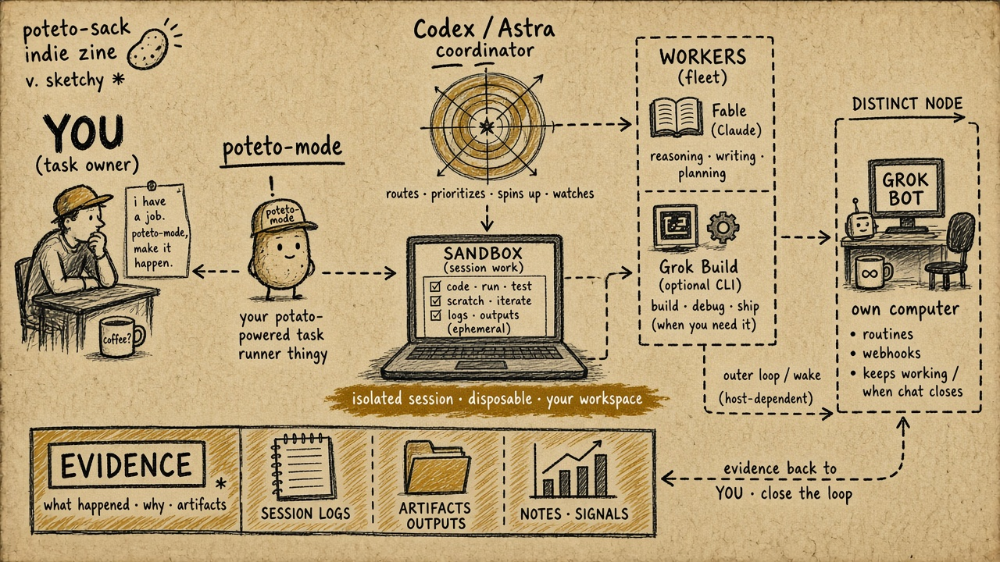
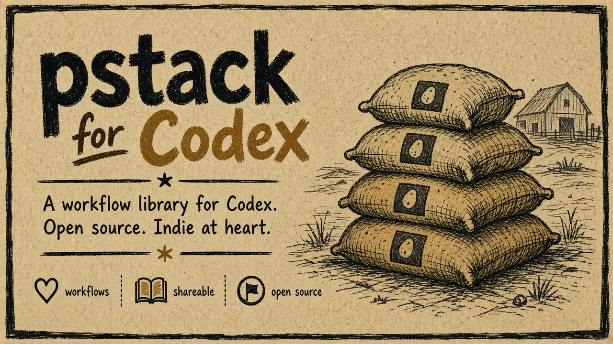
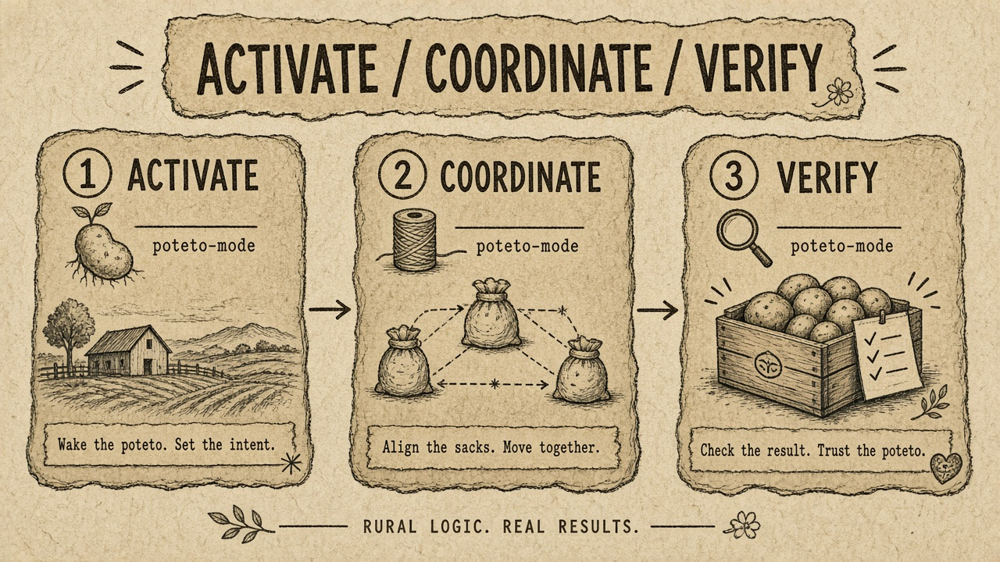
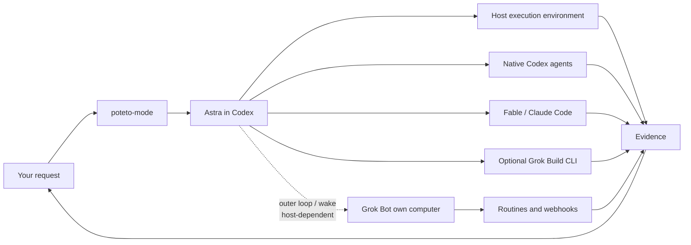
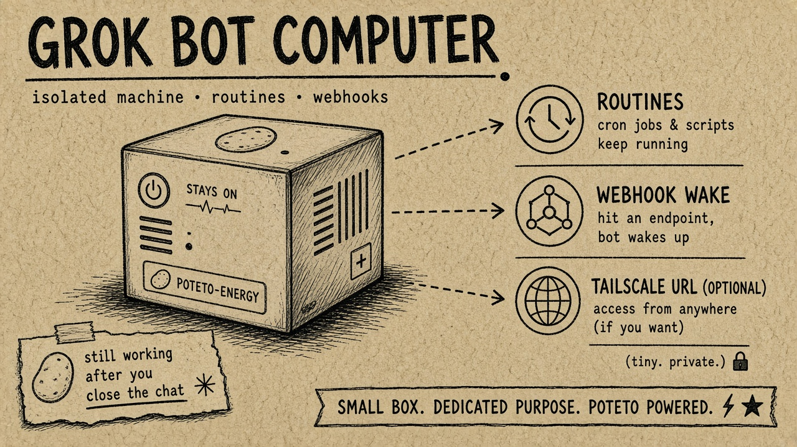
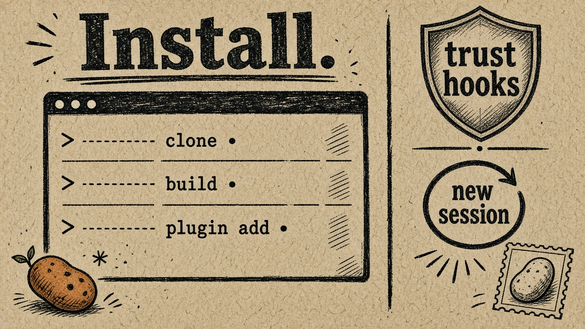

# pstack for Codex

<p align="center">
  
</p>

**Open-source workflow library for Codex** — a Codex port of [Lauren Tan’s (`@poteto`) pstack](https://github.com/cursor/plugins/tree/main/pstack). Potato energy, serious verification. Not an official Cursor, OpenAI, or xAI release.

The source is pinned to pstack **0.15.2** at `5bf2b1544db739998121a306340631963c2ff3de`. The original skills, principles, playbooks, and agent roles are preserved.

You talk to **poteto-mode**. **Astra** coordinates native agents and CLI workers. **Fable** through Claude Code and optional **Grok Build** return evidence. Optional **Grok Bot** provides its own cloud computer, routines, and webhook wakes. The host supplies execution protections, and the verified capabilities are listed below.

```text
$pstack-codex:poteto-mode <your task>
```

That’s the verified activation form. Follow-ups continue the work; `new task` rematches; `exit poteto-mode` stops the mode.

<p align="center">
  
</p>

## How it works

Use `$pstack-codex:poteto-mode` with your task. Explicit dollar-form mentions may appear on later prose lines and may end in punctuation; quoted examples and fenced code do not activate the mode. Slash-form activation stays on the first line. Poteto mode chooses the playbook and supporting skills. It can move through `how`, `architect`, `arena`, implementation, review and verification without you listing that sequence. Follow-ups continue the current work; `new task` rematches; `exit poteto-mode` stops applying the mode.

<p align="center">
  
</p>



Execution uses the current host's configured permissions and sandbox. The plugin does not create a disposable workspace or an isolated VM for every turn. Upstream pstack's `make-bot-ui` skill describes a UI and server on the Bot computer. The server POSTs JSON to a webhook routine and keeps the sender key out of the browser. Tailscale can make that page reachable.

This port preserves those instructions. Native Codex timed wake has passed a live check. The optional Bot app handoff has also returned a verified public-page screenshot. Live Bot webhook delivery, a reachable failure queue, and durable external event wakes remain unverified. See the [host contract](adapters/host.md) and [verification record](docs/verification.md).

## Grok Bot’s computer

<p align="center">
  
</p>

From `skills/make-bot-ui`: build a page; a server **on this computer** POSTs to a webhook routine; the bot wakes on `[routine]` with a `<webhook_event>` body. Secrets stay out of the browser and out of chat. Optional Tailscale for reachability. That computer is shared across agents on the node — one Tailscale hostname, not a second invented box.

The plugin is reusable across projects. Build commands, verification tools, deployment effects and business rules come from the current project. Activation and mode state are scoped to the conversation and project.

The external `cursor-team-kit` companions `deslop`, `control-cli`, and `control-ui` are included too. Poteto loads their bundled instructions when a workflow calls them. They do not need a separate install and are not registered as separate slash commands. Cursor's built-in authoring and automation tools have different portability limits. See [companion skills and built-ins](docs/companions.md).

## Status

This is an early, tested port, **not a claim of complete Cursor runtime parity**. Read [verification](docs/verification.md) for the exact evidence and remaining gaps.

- All **47 registered pstack skills**, **23 playbooks**, **23 principles**, two agent roles, three companion skills, and the three dormant Benny skills are retained.
- Claude analysis, writer and scoped local-Git reader profiles have been exercised against the real CLI; native/Claude handoffs and mode lifecycle have dedicated checks.
- Optional Grok analysis and file-reader profiles passed real production-adapter checks on the tested Linux build. Writer, shell access and non-Linux dispatch remain disabled. See [Grok's supported scope](docs/grok.md).
- Cursor cloud placement, durable wakeups (`/loop`, `/goal`, timed audit ticks and watcher-driven wakes), Grok Bot webhooks, Benny event automations, some transcript integrations and model-specific plan validation still have explicit limitations. Their source and routes remain present. Missing capabilities do not become silent weaker substitutes.

The [native workflow adapter](docs/native-workflows.md) maps goals, timed heartbeats, task identities and plan checks onto actual Codex capabilities. A real timed wake and its cleanup have passed. Across-turn event bridges and isolated cloud workers remain separate prerequisites; timed polling and worktrees do not pretend to replace them. See the [23-playbook capability map](docs/workflow-capabilities.json).

The integration candidate received two scoped Fable 5.1 approvals at its exact recorded commit. Astra completed the later Grok implementation and cleanup with the user's authorization. Those changes still need the final Fable review after its session limit resets. See the [integration review and remaining work](docs/integration-review.md) and the [earlier alpha record](docs/fable-review.md). This development candidate is not a newly approved release.

Use the [read-only doctor](docs/doctor.md) to distinguish installation, authentication and verified worker evidence. [Grok Bot](docs/grok-bot.md) is optional for cloud-computer and Bot-native work; ordinary coding and review do not require it.

## Install

<p align="center">
  
</p>

Requirements: a supported local Codex installation, Python 3.10+ on POSIX, and Git. Claude roles also require an independently installed and authenticated [Claude Code CLI](https://code.claude.com/docs/en/overview). Grok roles require independently installed [Grok Build](https://docs.x.ai/build/overview). Bun and GitHub CLI are needed for the upstream helpers that use them; they are not required for reading a skill.

```sh
git clone https://github.com/J0UH/pstack-codex.git
cd pstack-codex
python3 scripts/build.py --check
python3 scripts/package.py --check
codex plugin marketplace add .
codex plugin add pstack-codex@pstack-codex
```

Start a new Codex session after installing. Use `/hooks` to review and trust the two plugin hooks. Codex requires explicit trust; installing the plugin does not bypass that review. The hooks retain explicitly activated mode context and store conversation-local state. If the hooks are unavailable or untrusted, explicit skill use remains possible, but automatic restoration has not been established.

Use the packaged `setup-pstack` skill to inspect available models and confirm the role mapping. The [Astra/Claude example](examples/models.astra-claude.json) is a starting configuration, not an automatically applied change to your settings. Configuration is stored at the path printed by:

```sh
python3 scripts/pstack.py models path
```

Follow the [Codex setup procedure](docs/setup.md). Validate proposed settings with `python3 scripts/pstack.py models validate --file <draft.json>`. This checks the [schema](schemas/models.schema.json), not account access or model capability. Choosing a coordinator in JSON does not change an already-running Codex session's model or effort.

The default is `~/.codex/pstack/models.json` (honoring the normal Codex home). `PSTACK_MODEL_CONFIG` can select an explicit absolute path. State defaults to the same Codex home under `pstack/state`; `PSTACK_STATE_DIR` can select an absolute path for isolated runs. Relative overrides are rejected so changing the working directory cannot silently select different mode state.

With Codex's `workspace-write` sandbox, CLI mode updates need explicit write access to the shared state directory. Hook trust alone is insufficient. Launch with `--add-dir <absolute-state-directory>` after authorizing that directory, or configure one absolute `PSTACK_STATE_DIR` inside an authorized writable root for both hooks and tools before launch. See the [storage contract](adapters/host.md#activate-and-resume-the-mode). The plugin does not change your sandbox policy.

## Which models?

Upstream pstack's defaults use Grok for much implementation/exploration, Fable for judgment, prose and difficult work, and mixed Fable/Sol/Grok/Opus panels. The port retains configurable roles rather than treating those Cursor model slugs as executable CLI model names.

The supplied example uses Astra as coordinator, Claude Fable 5.1 for selected workers and reviewers, and an optional unenabled Grok entry. Model, reasoning effort and execution backend are separate fields. A reviewer family requirement remains meaningful; changing a model name does not create a different family. Availability is checked on the actual host. There is no automatic model fallback.

## Calling Claude behind the scenes

Codex prepares a scoped prompt file and a worker specification. The adapter invokes the standalone `claude` executable using its existing local login, records the request and result, then gives the receipt back to the coordinating agent.

```json
{
  "backend": "claude",
  "model": "claude-fable-5-1",
  "effort": "xhigh",
  "profile": "analysis",
  "cwd": "/absolute/path/to/project",
  "prompt_file": "/absolute/path/to/brief.txt",
  "run_dir": "/absolute/path/to/new-attempt-directory",
  "timeout_seconds": 300
}
```

```sh
python3 scripts/claude_worker.py --spec /absolute/path/to/spec.json
```

`analysis` has no tools. `reader` exposes file-reading tools and can add explicit scoped shell rules for investigator/verifier commands. `writer` adds file-editing tools with built-in permissions scoped to the primary working directory. Shell rules are permissions, not filesystem containment. Each role still receives its pstack instructions and project context. Claude does not inherit Codex connectors or browser sessions. The adapter preserves the existing subscription-login route and refuses conflicting inherited API-key/gateway overrides. It does not install Claude or manage subscriptions.

The receipt verifies transport, response-model attribution and effective capabilities. It is not a correctness verdict. The parent checks the actual artifact and acceptance criteria. See [Claude profiles and lifecycle](docs/claude.md), [Grok limitations](docs/grok.md), and the [host contract](adapters/host.md).

## Development and preservation

```sh
python3 scripts/build.py
python3 scripts/build.py --check
python3 -m venv .local/tests
.local/tests/bin/python -m pip install -r requirements-test.txt
.local/tests/bin/python -m unittest discover -s tests -v
python3 scripts/package.py
python3 scripts/package.py --check
```

Upstream helper tests, from `skills/poteto-mode/scripts`:

```sh
bun install --frozen-lockfile
bun test orch watch-pr
```

`upstream/` is the pinned source. `scripts/build.py` verifies its hashes and generates the Codex-facing tree. [adaptations.json](adaptations.json) records every generated difference. The installed distribution under `plugins/pstack-codex` is generated by `scripts/package.py`; edit the source tree, not that copy. The [adaptation register](adapters/ADAPTATIONS.md), [skill catalog](docs/skill-catalog-audit.md), and [playbook audit](docs/playbook-routing-audit.md) describe the behavioral contract.

Do not replace an upstream skill with a similarly named local skill, delete an inconvenient playbook, weaken a failed verification gate, or call a mocked provider a live proof. Upstream updates require a new pin, reviewed adaptations and repeated conformance checks. Preserve the MIT license and attribution.
